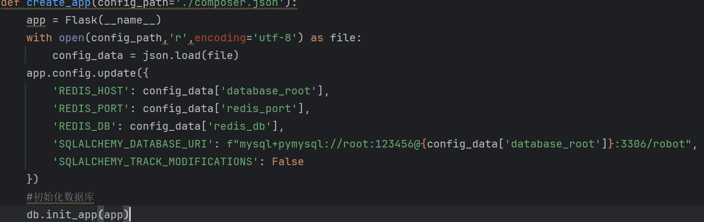

# 如何运行

## 后端：

- 安装所需包

- 配置database_root具体ip，redis端口

  

- 更改app.py中的初始化配置

  

- 如数据库相关内容

- 配置阿里云api密钥

  

  

## 前端

- 根据package.json  （删除package-lock.json后）执行

  ```
  npm install
  ```

- 在vue文件夹下运行

  ```
  npm run dev
  ```


## groovy脚本

- 修改具体脚本参考验收报告 这里提供 Main.gdsl和order.gdsl

- 运行Mains.groovy

  